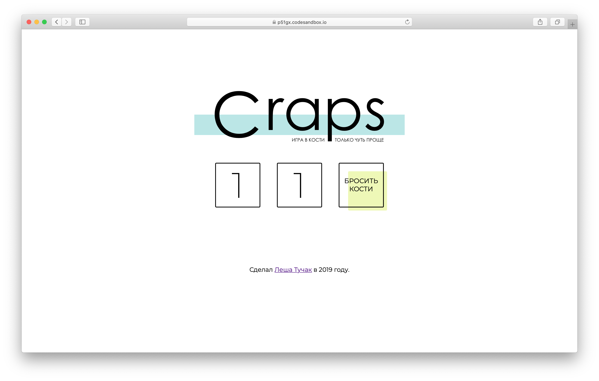

# Заключительный этап разработки игры «Крэпс»

> Поздравляю! Вы долшли почти до конца.

Обычно, в любом программном продукте указан автор и его контакты. В проекте уже есть подпрограмма, которая отвечает за выведение автора работы, но сейчас она не работает. Вам нужно исправить это.

**Алгоритм работы:**
+ Откройте в папке `utils` файл `getAuthor.js`.
+ Внутри подпрограммы `getAuthor`:
  + в поле `name` впишите свое имя
  + в поле `year` впишите год, в котором вы завершили разработку игры
  + в поле `link` впишите ссылку на свое социальную сеть
